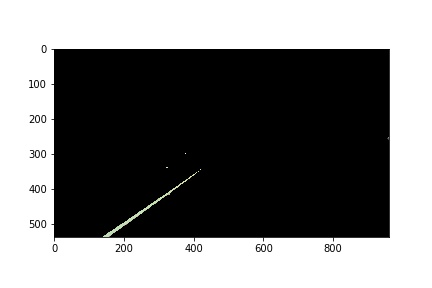
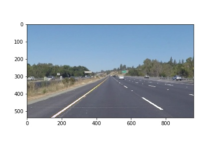
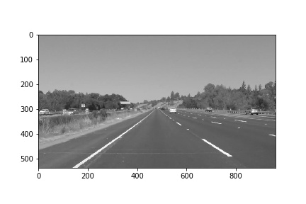
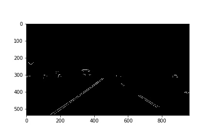
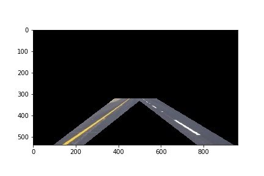
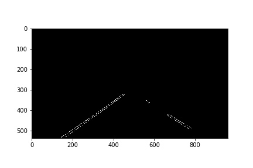
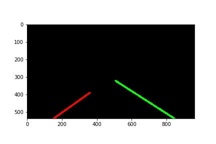
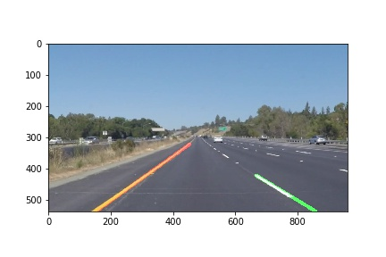

# **Finding Lane Lines on the Road** 

## Writeup Template

**Finding Lane Lines on the Road**

The goals / steps of this project are the following:
* Make a pipeline that finds lane lines on the road
* Reflect on your work in a written report
---

### Reflection

### 1. Pipeline for Lane Detection

My pipeline consisted of 5 steps.

**1. Masking yellow lines** 

I converted original image into HLS form and used cv2.InRange function to detect Yellow colored lanes from the image above and got following image as output after cv2.bitwise_and operation with original Image.

After this I performed **cv2.bitwise_or** with original image, to obtained image below for replaing yellow lanes with white color.
** **(Look at the left lane properly yellow color has been replaced with white)**

**2. Grayscale operation**
Converted RGB image to gray and got the following image :

**3. Gaussian Blur**

Performed the gaussian blurr operation to smoothened the unwanted intensity spikes expect at the edges. So Canny edge detection can detect the edges pretty clearly. I used the kernel size as 15 and obtained output as follows :

**4. Canny edge dectection**

I used **cv2.Canny(img, low_threshold, high_threshold)** with intensity difference thresholds as 50 and 150 respectively. (As it is recommended to use it in ratio 1:3 or 1:2. One can eperiment with it.) 

**5. Masking the Region Of Interest**

In masking the region of interest I used two types of polygon.

* Four sided polygon with lanes in the it.
* Triange to remove the extra edges detected inbetween the lanes.

And obtained the following the result :
[This is colored image to give you the context of masking]

Actual Image used for furthur processing :

**6. Hough lines Detector**

This was used to detect lines with parameters as ro = 2, thetat = pi/2 , min_line_length = 20 and threshold = 15.
* ro is resolution of lines which are to be detected.
* theta is sweep of angle in which lines are to be detected.
* * min_line_length denotes the min length for which lines is to be detected.
* Threshold is the min number of pixles the line should pass to detect it as a line.

After this I used slope as parameter to identify left and right lanes from the group of lines obtained from hough line transform.
And then performed moving window averaging on the slope and constants of the lines. Finally I had obtained an **Average Slope** and **Average Y-Intercept(Constant of line)** for both the lanes left and right respectively.

Moving window averaging was also performed to keep track of Minimum Y values for two lanes differently to get the reference start and end points for the lines.

**7. Weighted final image**

Finally merged the original and above image to get the final output:

### 2. Potential shortcomings

* One potential shortcoming would be what would happen when there is shadow and turning of roads at the same time. The masking on HLS transformation cant detect the lanes properly. And also as I m always plotting the staright lines the Lines will be skewed all the times. 

* Another shortcoming could be brightness of road changing in daylight.

### 3. Possible improvements

A possible improvement would be to spline fitting the lines obtained from hough lines transform and not performing the moving window protocol.

Another potential improvement could be to keep left and right lanes ymin as same to avoid this difference in lengths :

